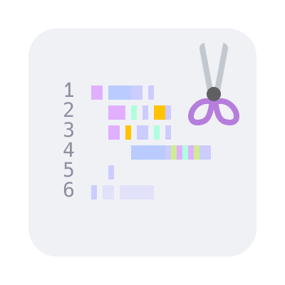
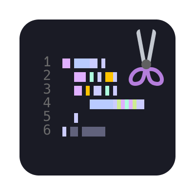
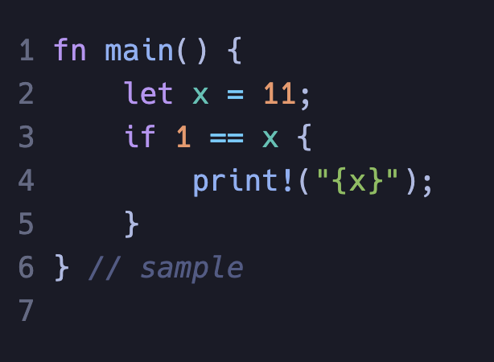

# Code Clipper

<div align="center">
  
  
</div>

Clip code with **your IDE's theme** and **line numbers**!

## Features

- No Internet needed
- Use your VSCode theme and syntax highlighting
- Mark line numbers
- Copy the plain text with line numbers to your clipboard
- Supports MacOS and Windows. Linux is planned



## Requirements

`puppeteer` is required (used to generate image).

Installation:
install Chrome.

Then config `code-clipper.puppeteerPath` in VSCode settings.

> Typical for MacOS: `/Applications/Google Chrome.app/Contents/MacOS/Google Chrome`
>
> Typical for Windows: `C:\\Program Files\\Google\\Chrome\\Application\\chrome.exe`
<!-- >
> Typical for Linux: -->

<!-- ⚠️***Special for Linux:***
`xclip` (maybe) should be installed -->

## Usage

`Command + Shift + p` (or `Ctrl + Shift + p`) to open the command palate.

Then,

- use "Clip Code" to generate the code clip image and open the directory (behavior can be adjusted with `code-clipper.openDirectoryAfterClipping`)
- use "Clip Code as Plain Text" to copy plain-text code with line number to clipboard

Example:

```rust
fn main() {
    let x = 11;
    if 1 == x {
        print!("{x}");
    }
} // sample

```

Using "Clip Code":


Using "Clip Code as Plain Text":

```txt
1: fn main() {
2:     let x = 11;
3:     if 1 == x {
4:         print!("{x}");
5:     }
6: } // sample
```

## Extension Settings

Following are settings, their default values, and descriptions:

- `code-clipper.puppeteerPath`: ""

  The path to puppeteer. ***MUST HAVE!!!***

  - Typical for MacOS: `/Applications/Google Chrome.app/Contents/MacOS/Google Chrome`.
  - Typical for Windows: `C:\\Program Files\\Google\\Chrome\\Application\\chrome.exe`.
  <!-- - Typical for Linux: -->
- `code-clipper.clipSavingDirectory`: ""

  Config where to save the code clip to. If not set, the clips will be saved to the extension's storage directory.

  Examples values:

  - MacOS: `/Users/${username}/Downloads/`.
  - Windows: `C:\\Users\\${username}\\Downloads\\`.
  <!-- - Linux: -->
- `code-clipper.openDirectoryAfterClipping`: True

  Config whether to open the saving directory or not.

## License

Licensed under [MIT](https://github.com/arom1a/code-clipper/blob/main/LICENSE).

## Release Notes

See [CHANGELOG.md](https://github.com/arom1a/code-clipper/blob/main/CHANGELOG.md).
